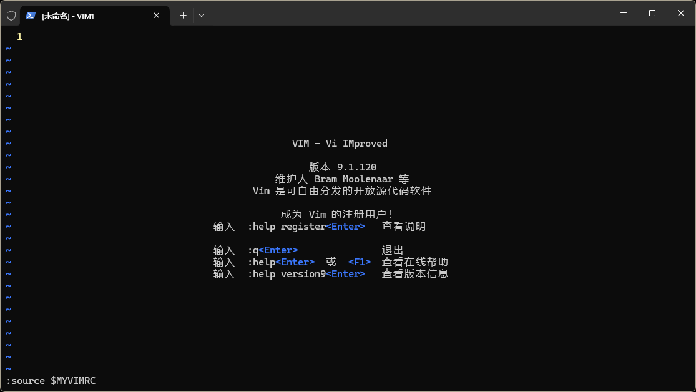
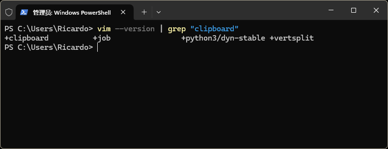
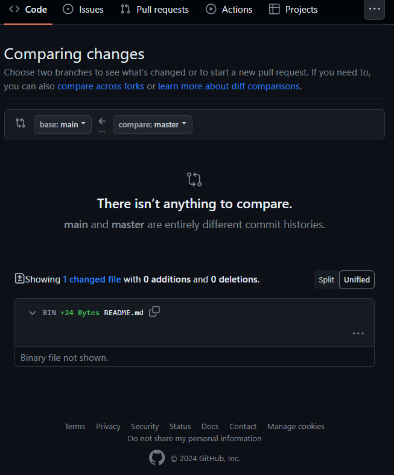

# 折腾日记 Diary of Tweaking on software tools

## 2024.03.15 vim调优和极简java环境配置 

- Optimizing vim configuration and Minimum Java environment installation

### ***1. vim调优***

#### ***1.1  缘起动因***
【太长可以不看】简要概括，`Windows`版Vim/gVim由于默认配置中的`backup`特性，产生大量备份文件造成git仓库管理异常脏乱。
<details>
  <summary>点击查看详情</summary>
通过简简单单的修改.gitignore文件来忽略大量的`.un~`和`*.*~`文件，仅仅只能维持remote仓库的整洁，并且由于备份文件扩展名是在原扩展名基础上加"~"，因此防不甚防，`.gitignore`很难全部覆盖。

并且本地的文件结构也显得异常脏乱，鉴于Vim本身自带的编辑保护机制已经很健全，并且使用git管理，有多个可回滚目标，因此选择关闭`Vim`的`backup`特性。自此开始了一场挠头不断的折腾之旅。
</details>

#### ***1.2  关闭Vim 自动备份功能***

需要调整`.vimrc`文件，在`Windows`上显示为`_vimrc`文件或者`.vimrc`文件，两者有其一即可,会冲突。以笔者Win11`22H2`的两部机型操作来说，不存在差异，随便改动一个就可以，但是**`.vimrc`位置**很有讲究。`Vim`本身并没有在PATH生成这个文件，默认的vimrc和用户级别vimrc并不冲突，用户vimrc堆叠覆盖在默认vimrc上，该文件就是用作vim的配置的，可以理解成很多软件的.config文件。

- 确定`.vimrc/_vimrc`位置
    - 	直接进Vim，在Vim中执行命令`echo $HOME`来显示Vim配置文件所在位置
    -   手动搜索：GUI界面的文件管理器中打开 C:\Users\你的本机用户名 路径，该路径下一般存着本机的`.vimrc/_vimrc`;或者在该路径打开命令台输入指令`ls | grep "vimrc"`模糊搜索`.vimrc/_vimrc`二者之一。
    -   插播下，Windows的power shell命令台不支持grep命令，内置指令又很复杂，可通过Scoop或者Choco等包管理软件，管理员模式的powershell下几秒钟装一个grep包一劳永逸`choco install grep`。
    -   有就直接改，没有就创一个文件，命令都是一样的`vim _vimrc`,以下内容添加进去就达成了关闭自动同步特性。
        ```vim
        set nobackup
        set nowritebackup
        ```
- Vim下加载配置     
    - 	直接命令行一行进入Vim
        ```bash
        vim
        ```  
    -   vim主界面直接输入
        ```bash
        :source $MYVIMRC
        ```
        

退出后使用`Vim`创建或者编辑任意文件验证，解决。


#### ***1.3  解决Vim 退格删除键无法删除的问题***
随着自动备份问题的解决，验证`Vim`日常使用的时候，一个更严重的问题产生了：使用`Vim`编辑文件在i模式编辑模式下无法使用退格键`Backspace`删除非本次编辑生成的内容，并且无法删除换行符。`Delete`也仅仅只能删除一个字符。

根据检索排查，发现新的`_vimrc/.vimrc`文件覆盖了系统自带的默认属性，使得一些`Vim`默认的其他特性消失了，比如对于退格`backspace` 的定义(而这恰恰就是退格失效的原因)，比如默认语法高亮都消失了。

- 因此再次编辑`_vimrc`,过程不再赘述，添加这行代码。
    ```bash
    set backspace=indent,eol,start
    ```
- 目前`_vimrc`文件内容总体如下
    ```bash
    set nobackup
    set nowritebackup
    set backspace=indent,eol,start
    ```

#### ***1.4  解决Vim 无法和系统剪切板完全交互 单向粘贴无法复制***
既然走到这步，索性将win下`Vim`的另外一个痛点解决。即跑在Windows Terminal或者Powershell之下的命令行`Vim`都只能由外部向`Vim`内粘贴内容，但是`Vim`内代码却无法复制出去。也装过各种插件，其实没用✌。因此在摸爬滚打中将解决方案和摸索思路分享下。也许在我摸索的头几步大部分人类似的问题已经解决了。

- 首先确保系统本身和`Vim`版本都支持剪贴板Clipboard功能
    
    - 就我个人的情况而言，系统`Windows™` 11 `22H2`，自`Windows™`10大版本起甚至都支持剪切板历史了
    - 就我安装的Vim而言，win发行版的`Vim`不论是下载安装包手动安装，还是使用Scoop或者Chocolatey这类包管理软件进行命令行安装，都是带有`gVim`可视化版本的整个套件，必然支持剪切板，并且已经能读取命令台Power shell外部的系统剪切板，就是无法调用本地。
    - `Linux`用户有可能默认安装的老版本不支持Clipboard功能。最快的解决版本是用`apt`安装一个`gVim`
    -检查`Vim`支持该特性与否
        ```bash
        vim --version | grep "clipboard"
        ```
        
        - 如图所示输出结果为`+clipboard`,即为支持；如显示为`-clipboard`则表示不支持

- 调整`_vimrc/.vimrc`文件来确保`Vim`调用系统默认剪切板
    - 将下列命令加入`_vimrc/.vimrc`
        ```bash
        set clipboard=unnamedplus
        ```
    - 如果无效的话，建议删除。两种检验有效与否的方法。
        - 使用`Vim`自带的复制命令，显式使用`"*`寄存器复制,到外部的应用软件进行粘贴。笔者失败了。
        - 使用`Ctrl`+`C`的系统级快捷键复制命令太内Vim正在编辑的文本。笔者还是失败了
- 100%有效的方法：通过`Vim`配置文件`_vimrc/.vimrc`直接自定义命令映射，用`Windows`自带的Power shell命令行工具指令clip.exe来实现访问系统剪切板。
    - 将下列命令加入`_vimrc/.vimrc`以补足`Vim`向外复制的功能
        ```vim
        " 复制到系统剪贴板
        vnoremap <C-c> :w !clip<CR><CR>
        ```
    - 以备还有其他苦主，连`Windows`向`Vim`内粘贴也遇上问题，这里提供相对应的另一条命令
        ```vim
        " 从系统剪贴板粘贴
        nnoremap <C-v> :r !powershell Get-Clipboard<CR><CR>
        ```
    - 我本人至此`_vimrc`文件全貌，可见仓库`/src`文件夹
    
        [点击下载 "_vimrc"](downloads/your_file_name)

        ```vim
        set nobackup
        set nowritebackup
        set backspace=indent,eol,start
        set number
        vnoremap <C-c> :w !clip<CR><CR>
        ```


#### ***1.5  微调Vim参数***
- 我只是一个正式学习CS不满一年的绿手，非`Vim`重度使用者。但是在快速修改内容的同时，也有必要稍稍提升下`Vim`的基础使用体验，我的最终版本`_vimrc`添加了代码高亮、行数显示和必要时的鼠标启用特性。
    - 最终自用版本`_vimrc`
    - 代码高亮、行数显示、鼠标特性均已注释
        ```vim
        set nobackup
        set nowritebackup
        set backspace=indent,eol,start
        set number "行数显示
        syntax enable "代码高亮
        set mouse=a "鼠标特性支持
        vnoremap <C-c> :w !clip<CR><CR>
        ```

- 步入现代了，还有人再用`Vim`✌。原因有很多，初见时只觉得迂腐，稍微熟悉一点，才渐渐意识到Geek们口中无上限的`Vim`到底是多么重剑无锋，天下武功唯快不破的基调下这把倚天剑轻盈灵巧。在初学Coding的周芷“弱”们手中，这把武器谈不上最相称，副作用可能还不小；但是王重阳手中，倚天剑称得上举世无双。有极爱折腾的圣手，甚至出过`Vim`爆改IDE的教程。仅作一点感慨。
### ***2. java环境极简配置***
不得已使用重型IDE intellijIDEA(以下简称"IDEA")，以便课程项目debug。
基本的开发环境，以最新LTS版jdk17为标准。


#### ***2.1 要求***
- vagrant debian 12 虚拟机安装基本的jdk
- 物理机安装jdk，maven和Java重型IDE
- 不破坏两者的环境，不冲突
- 最小化安装，最简单维护

#### ***2.2 注意事项***
- 在virtual-Vagrant安装jdk之前先行安装实体机的java环境，否则会被共享jdk，要设置HOME_JAVA的环境变量将变麻烦
- 安装虚拟机的maven时候，不能单纯像debian12的Linux教程一样安装maven后配置环境，无需这一步，这一步将会导致`/etc/environment`覆盖掉虚拟机的最基本配置，导致永远无法通过命令台`vagrant halt`命令，且永远只能访客登录
- `Windows™`下先行安装chocolatey包管理软件，以便choco接替用户的手动配置环境变量以及手动“下一步”安装后手动删除安装包
    ```powershell
    Set-ExecutionPolicy Bypass -Scope Process -Force
    iex ((New-Object System.Net.WebClient).DownloadString('https://chocolatey.org/install.ps1'))
    ```
    - 验证安装
    ```powershell
    choco -v
    ```

#### ***2.3 实现命令行***

- `Windows™`

    请一定注意要在管理员权限下打开power shell，来使用choco，原理是：Choco会配置环境变量，需要高权限。

    - jdk

        ```powershell
        choco install openjdk17 17.0.2.20220913
        ```

    - maven
        ```powershell
        choco install maven
        ```

    - IDEA
        ```powershell
        choco install intellijidea-community
        ```
- Vagrant虚拟机debian 12
    ```bash
    sudo apt upgrade
    sudo apt install default-jdk
    java -version
    sudo apt install maven
    mvn -version
    ```
    千万千万不要动环境，以上！


## 2024.03.16 git repo 本地和远程冲突的解决

当本地建立git仓库和远程代码托管平台上建立远程git仓库，两个动作并不匹配的时候，会出现一系列的同步问题。以我本次遇到的情况简述：先在本地建立并初始化一git repo，并在本地多次进行一系列 `git add` 和 `git commit` 操作，搭了本仓库的雏形；

```bash
git init UoB-Software-Tools
cd UoB-Software-Tools
echo "# UOB-Software-Tools" >> README.md
git add README.md
git commit -m "Initialize the repo and generate README.md"
```


使用以下命令push的时候出现报错：

```powershell
PS ~\GameJam> git push

fatal: No configured push destination.
Either specify the URL from the command-line or configure a remote repository 

```

然后想起来要 `git push` 到远程仓库，遂在github上建立了公开同名仓库。**一定注意将线上和本地的两个仓库连接起来**。
```bash
git remote add origin <远程仓库的URL地址>
```

但是当我再次push时依旧报错：

```Powershell
PS C:\Users\Ricardo\Videos\GameJam\GameJam> git push
fatal: The current branch master has no upstream branch.
To push the current branch and set the remote as upstream
```
意味着Git此时没有弄明白，我要将本地这唯一的分支推送到远程仓库的哪个分支。我们必须手动指定，哪怕远程分支只有一个，Git也会要求我们指定。互联网检索的信息告诉我，使用这条命令解决这个问题。**万勿直接**执行这条语句，它给我带来了又一堆麻烦。
```
git push -u origin master
```
这个命令将推送当前本地 master 分支的更改到远程仓库，并将远程仓库的 master 分支设置为本地 master 分支的上游分支。这样，以后再次使用 git push 时，Git 就会自动将更改推送到远程仓库的 master 分支。

问题就出在这里，对于一个本地仓库而言， `git init` 命令初始化全新的仓库后Git不会为用户自动创建任何分支（如果没有任何 `git commit` 记录的话运行 `git branch` 命令，它不会显示任何分支信息）。执行过 `git add` `git commit` 流程后，git创建的本地唯一且默认的分支确实是`master`，**但是远程Github建立仓库时自动生成的唯一默认分支是`main`**。这就导致了我执行上述命令后再进行 `git push` 出现了麻烦，远程仓库出现了两个分支，且本地内容上传成为了非默认分支，两者还无法合并。

理由是两个分支（`main` 和 `master`）之间没有可以比较的内容，因为它们具有完全不同的提交历史记录,甚至有可能不是同一起点（确实如此，本人本地repo是命令行git命令在本地初始化的并将工作区 (working directory) 内容暂存、提交到本地仓库，github托管的远程repo是线上由github初始化的且无任何 `git commit` 记录）。


快刀斩乱麻，展示出目前本地和远程的仓库，在本地建立一个和远程默认仓库分支一致的分支，将本地master分支

```bash
git branch -a #显示所有本地和远程分支
git branch -r #显示远程分支
git branch #显示本地所有分支
```
远程分支会以 `remotes/<remote_name>/<branch_name> ` 的形式显示。我的情况显示为，于是通过 `git pull` 将完整的远程仓库所有分支信息同步过来。
```Powershell
PS > git branch -a
* master
  remotes/origin/master
```

在本地创建一个名为 `main` 的同名新分支，并且切换到这个分支上。新分支的内容是从当前分支（本地 `master` 分支）复制过来的，包括当前分支上的所有文件和提交历史。
```bash
git checkout -b main
```
创建新分支，如果没有将它与远程仓库的分支关联起来，执行 `git push` 命令时，Git 不知道要将更改推送到哪个远程分支会报错（这点前面已经知道，只不过**每个本地分支进行远程分支关联需要手动设置，前面进行的关联映射仅作用于master和remote/master**,这条命令可简化本地远程同名分支的映射`git config --global push.default current
`）。因此执行
```
git config --global push.default current
```
以进行默认自动同名分支映射，

或
```
git branch --set-upstream-to=origin/main main
```
单独设置该分支和远程分支映射关联关系。

然后运行 `git pull origin main --allow-unrelated-histories`使用 `--allow-unrelated-histories` 选项来允许合并不相关的历史记录。
随后的`git push`失败了，原因是存在冲突文件，而`git status`可以揭示在push和pull过程中存在冲突的文件。而由于本地和远程仓库都有`README.md`文件所以显示出来的日志告诉我不管是push还是pull都需要先解决冲突
```powershell
Unmerged paths:
  (use "git add <file>..." to mark resolution)
        both added:      README.md
```
走一遍add、commit的流程可以在本地文件中标记这个文件的冲突之处
```
<<<<<<< HEAD
当前分支的更改

=======
其他分支的更改

>>>>>>> <commit>
```
做好取舍，删除所有有关的标记，最后一记push解千愁。


